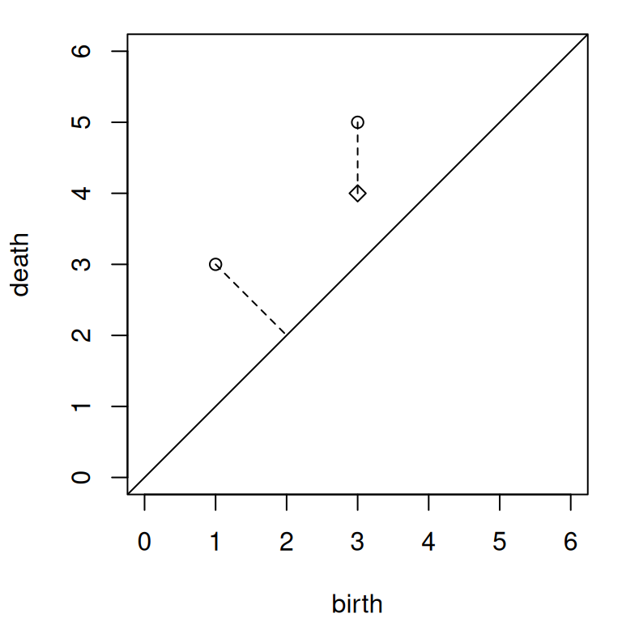
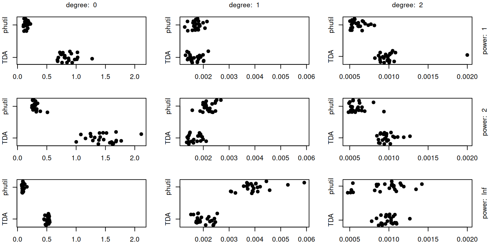

# Validation and Benchmark of Wasserstein Distances

This vignette introduces the Wasserstein and bottleneck distances
between persistence diagrams and their implementations in {phutil},
adapted from [Hera](https://github.com/anigmetov/hera), by way of two
tasks:

1.  Validate the implementations on an example computed by hand.
2.  Benchmark the implementations against those provided by {TDA}
    (adapted from Dionysus).

In addition to {phutil}, we access the {tdaunif} package to generate
larger point clouds and the {microbenchmark} package to perform
benchmark tests.

## Definitions

*Persistence diagrams* are multisets (sets with multiplicity) of points
in the plane that encode the interval decompositions of persistent
modules obtained from filtrations of data (e.g. Vietoris–Rips
filtrations of point clouds and cubical filtrations of numerical
arrays). Most applications consider only ordinary persistent homology,
so that all points live in the upper-half plane; and most involve
non-negative-valued filtrations, so that all points live in the first
quadrant. The examples in this vignette will be no exceptions.

We’ll distinguish between persistence diagrams, which encode one degree
of a persistence module, and *persistence data*, which comprises
persistent pairs of many degrees (and annotated as such). Whereas a
diagram is typically represented as a 2-column matrix with columns for
birth and death values, data are typically represented as a 3-column
matrix with an additional column for (whole number) degrees.

The most common distance metrics between persistence diagrams exploit
the family of *Minkowski distances* $D_{p}$ between points in
${\mathbb{R}}^{n}$ defined, for $1 \leq p < \infty$, as follows:

$$D_{p}(x,y) = \left( \sum\limits_{i = 1}^{n}{(x_{i} - y_{i})^{p}} \right)^{1/p}.$$

In the limit $\left. p\rightarrow\infty \right.$, this expression
approaches the following auxiliary definition:

$$D_{\infty}(x,y) = \max\limits_{i = 1}^{n}{|x_{i} - y_{i}|}.$$

As the parameter $p$ ranges between $1$ and $\infty$, three of its
values yield familiar distance metrics: The taxicab distance $D_{1}$,
the Euclidean distance $D_{2}$, and the Chebyshev distance $D_{\infty}$.

The [*Kantorovich* or *Wasserstein
metric*](https://en.wikipedia.org/wiki/Wasserstein_metric) derives from
the problem of optimal transport: What is the minimum cost of relocating
one distribution to another? We restrict ourselves to persistence
diagrams with finitely many off-diagonal point masses, though each
diagram is taken to include every point on the diagonal. So the cost of
relocating one diagram $X$ to another $Y$ amounts to (a) the cost of
relocating some off-diagonal points to other off-diagonal points plus
(b) the cost of relocating the remaining off-diagonal points to the
diagonal, and vice-versa.

Because the diagonal points are dense, this cost depends entirely on how
the off-diagonal points of both diagrams are matched—either to each
other or to the diagonal, with each point matched exactly once. For this
purpose, define a *matching* to be any bijective map
$\left. \varphi:X\rightarrow Y \right.$, though in practice we assume
that almost all diagonal points are matched to themselves and incur no
cost.

The cost $D(x,\varphi(x))$ of relocating a point $x$ to its matched
point $\varphi(x)$ is typically taken to be a Minkowski distance
$D_{q}(x,\varphi(x)) = \left\| x - \varphi(x) \right\|_{q}$, defined by
the $L^{q}$ norm on ${\mathbb{R}}^{2}$. (While simple, this geometric
treatment elides that the points in the plane encode the collection of
interval modules into which the persistence module decomposes. Other
metrics have been proposed for this space, but we restrict to this
family here.)

The total cost of the relocation is canonically taken to be the
Minkowski distance
$\left( \sum_{x \in X}{D_{q}(x,\varphi(x))^{p}} \right)^{1/p}$ of the
vector of matched-point distances. The Wasserstein distance is defined
to be the infimum of this value over all possible matches. This yields
the formulae

$$W_{p}^{q}(X,Y) = \inf\limits_{\varphi:X\rightarrow Y}\left( \sum\limits_{x \in X}{\left\| x - \varphi(x) \right\|_{q}}^{p} \right)^{1/p},$$

for $p < \infty$ and

$$W_{\infty}^{q}(X,Y) = \inf\limits_{\varphi:X\rightarrow Y}{\max\limits_{x \in X}\left\| x - \varphi(x) \right\|_{q}}$$

for $p = \infty$.

See Cohen-Steiner et al. ([2010](#ref-cohen2010lipschitz)) and Bubenik
et al. ([2023](#ref-bubenik2023exact)) for detailed treatments and
stability results on these families of metrics.

## Validation

### Distances between nontrivial diagrams

The following persistence diagrams provide a tractable example:

$$X = \begin{bmatrix}
1 & 3 \\
3 & 5
\end{bmatrix},\phantom{X = Y}Y = \begin{bmatrix}
3 & 4
\end{bmatrix}.$$

For convenience in the code, we omit dimensionality and focus only on
the matrix representations.

``` r
X <- rbind(
  c(1, 3),
  c(3, 5)
)
Y <- rbind(
  c(3, 4)
)
```

We overlay both diagrams in [Figure 1](#fig-plot-small). Note that the
vector between the off-diagonal points $(1,3)$ of $X$ and $(3,4)$ of $Y$
is $(2,1)$, while the vector from $(1,3)$ to its nearest diagonal point
$(2,2)$ is $(1,-1)$. That one coordinate is the same size while the
other is smaller implies that an optimal matching will always match
$(1,3)$ with the diagonal, so long as $p \geq 1$. A similar argument
necessitates that $(3,4)$ of $Y$ must match with $(3,5)$ of $X$.

``` r
oldpar <- par(mar = c(4, 4, 1, 1) + .1)
plot(
  NA_real_,
  xlim = c(0, 6), ylim = c(0, 6), asp = 1, xlab = "birth", ylab = "death"
)
abline(a = 0, b = 1)
points(X, pch = 1)
points(Y, pch = 5)
segments(X[, 1], X[, 2], c(2, Y[, 1]), c(2, Y[, 2]), lty = 2)
par(mar = init_par$mar)
```



Figure 1: Overlaid persistence diagrams $X$ (circles) and $Y$ (diamond)
with dashed segments connecting optimally matched pairs.

Based on these observations, we get this expression for the Wasserstein
distance using the $q$-norm half-plane metric and the $p$-norm “matched
space” metric:

$$W_{p}^{q}(X,Y) = ({\left\| a \right\|_{q}}^{p} + {\left\| b \right\|_{q}}^{p})^{1/p},$$

where $a = (1,-1)$ and $b = (0,-1)$ are the vectors between matched
points. We can now calculate Wasserstein distances “by hand”; we’ll
consider those using the half-plane Minkowski metrics with
$q = 1,2,\infty$ and the “matched space” metrics with $p = 1,2,\infty$.

First, with $q = 1$, we get $\left\| a \right\|_{q} = 1 + 1 = 2$ and
$\left\| b \right\|_{q} = 0 + 1 = 1$. So the $(1,p)$-Wasserstein
distance will be the $p$-Minkowski norm of the vector $(2,1)$, given by
$W_{p}^{1}(X,Y) = (2^{p} + 1^{p})^{1/p}$. This nets us the values
$W_{1}^{1}(X,Y) = 3$ and $W_{2}^{1}(X,Y) = \sqrt{5}$. And then
$W_{\infty}^{1}(X,Y) = {\max}(2,1) = 2$. The reader is invited to
complete the rest of [Table 1](#tbl-small).

| Metric       | $\left\| a \right\|$ | $\left\| b \right\|$ |    $W_{1}$     |  $W_{2}$   | $W_{\infty}$ |
|:-------------|:--------------------:|:--------------------:|:--------------:|:----------:|:------------:|
| $L^{1}$      |          2           |          1           |       3        | $\sqrt{5}$ |      2       |
| $L^{2}$      |      $\sqrt{2}$      |          1           | $1 + \sqrt{2}$ | $\sqrt{3}$ |  $\sqrt{2}$  |
| $L^{\infty}$ |          1           |          1           |       2        | $\sqrt{2}$ |      1       |

Table 1: Distances between optimally paired features and Wasserstein
distances between $X$ and $Y$ for several choices of half-plane and
“matched space” metrics.

The results make intuitive sense; for example, the values change
monotonically along each row and column. Let us now validate the bottom
row—using the $L^{\infty}$ distance on the half-plane, giving the
popular *bottleneck distance*—using both Hera, as exposed through
{phutil}, and Dionysus, as exposed through {TDA}:

``` r
wasserstein_distance(X, Y, p = 1)
#> [1] 2
wasserstein_distance(X, Y, p = 2)
#> [1] 1.414214
bottleneck_distance(X, Y)
#> [1] 1
```

In order to compute distances with {TDA}, we must restructure the PDs to
include a `"dimension"` column. Note also that
[`TDA::wasserstein()`](https://rdrr.io/pkg/TDA/man/wasserstein.html)
does not take the $1/p$th power after computing the sum of $p$th powers;
we do this manually to get comparable results:

``` r
TDA::wasserstein(cbind(0, X), cbind(0, Y), p = 1, dimension = 0)
#> [1] 2
sqrt(TDA::wasserstein(cbind(0, X), cbind(0, Y), p = 2, dimension = 0))
#> [1] 1.414214
TDA::bottleneck(cbind(0, X), cbind(0, Y), dimension = 0)
#> [1] 1
```

### Distances from the trivial diagram

An important edge case is when one persistence diagram is trivial,
i.e. contains only the diagonal so is “empty” of off-diagonal points.
This can occur unexpectedly in comparisons of persistence data, as the
data may be large but higher-degree features present in one set but
absent in another. To validate the distances in this case, we create an
empty diagram $E$ and use the same code to compare it to $X$. The point
$(3,5)$ of $X$ will be matched to the diagonal $(4,4)$, which yields the
same $\infty$-distance $1$ so the $L^{\infty}$ Wasserstein distances
will be the same as before.

``` r
# empty PD
E <- matrix(NA_real_, nrow = 0, ncol = 2)
# with dimension column
E_ <- cbind(matrix(NA_real_, nrow = 0, ncol = 1), E)
# distance from empty using phutil/Hera
wasserstein_distance(E, X, p = 1)
#> [1] 2
wasserstein_distance(E, X, p = 2)
#> [1] 1.414214
bottleneck_distance(E, X)
#> [1] 1
# distance from empty using TDA/Dionysus
TDA::wasserstein(E_, cbind(0, X), p = 1, dimension = 0)
#> [1] 2
sqrt(TDA::wasserstein(E_, cbind(0, X), p = 2, dimension = 0))
#> [1] 1.414214
TDA::bottleneck(E_, cbind(0, X), dimension = 0)
#> [1] 1
```

## Benchmarks

For a straightforward benchmark test, we compute PDs from point clouds
sampled with noise from two one-dimensional manifolds embedded in
${\mathbb{R}}^{3}$: the circle as a trefoil knot and the segment as a
two-armed archimedian spiral. To prevent the results from being
sensitive to an accident of a single sample, we generate lists of 24
samples and benchmark only one iteration of each function on each.

``` r
set.seed(28415)
n <- 24
PDs1 <- lapply(seq(n), function(i) {
  S1 <- tdaunif::sample_trefoil(n = 120, sd = .05)
  as_persistence(TDA::ripsDiag(S1, maxdimension = 2, maxscale = 6))
})
PDs2 <- lapply(seq(n), function(i) {
  S2 <- cbind(tdaunif::sample_arch_spiral(n = 120, arms = 2), 0)
  S2 <- tdaunif::add_noise(S2, sd = .05)
  as_persistence(TDA::ripsDiag(S2, maxdimension = 2, maxscale = 6))
})
```

Both implementations are used to compute distances between successive
pairs of diagrams. The computations are annotated by homological degree
and Wasserstein power so that these results can be compared separately.

``` r
PDs1_ <- lapply(lapply(PDs1, as.data.frame), as.matrix)
PDs2_ <- lapply(lapply(PDs2, as.data.frame), as.matrix)
# iterate over homological degrees and Wasserstein powers
bm_all <- list()
PDs_i <- seq_along(PDs1)
for (dimension in seq(0, 2)) {
  # compute
  bm_1 <- do.call(rbind, lapply(seq_along(PDs1), function(i) {
    as.data.frame(microbenchmark::microbenchmark(
      TDA = TDA::wasserstein(
        PDs1_[[i]], PDs2_[[i]], dimension = dimension, p = 1
      ),
      phutil = wasserstein_distance(
        PDs1[[i]],  PDs2[[i]],  dimension = dimension, p = 1
      ),
      times = 1, unit = "ns"
    ))
  }))
  bm_2 <- do.call(rbind, lapply(seq_along(PDs1), function(i) {
    as.data.frame(microbenchmark::microbenchmark(
      TDA = sqrt(TDA::wasserstein(
        PDs1_[[i]], PDs2_[[i]], dimension = dimension, p = 2
      )),
      phutil = wasserstein_distance(
        PDs1[[i]],  PDs2[[i]],  dimension = dimension, p = 2
      ),
      times = 1, unit = "ns"
    ))
  }))
  bm_inf <- do.call(rbind, lapply(seq_along(PDs1), function(i) {
    as.data.frame(microbenchmark::microbenchmark(
      TDA = TDA::bottleneck(
        PDs1_[[i]], PDs2_[[i]], dimension = dimension
      ),
      phutil = bottleneck_distance(
        PDs1[[i]],  PDs2[[i]],  dimension = dimension
      ),
      times = 1, unit = "ns"
    ))
  }))
  # annotate and combine
  bm_1$power <- 1; bm_2$power <- 2; bm_inf$power <- Inf
  bm_res <- rbind(bm_1, bm_2, bm_inf)
  bm_res$degree <- dimension
  bm_all <- c(bm_all, list(bm_res))
}
bm_all <- do.call(rbind, bm_all)
```

[Figure 2](#fig-benchmark-large) compares the distributions of runtimes
by homological degree (column) and Wasserstein power (row). We use
nanoseconds in {microbenchmark} when benchmarking to avoid potential
integer overflows. Hence, we convert the results into seconds ahead of
formatting the axis in seconds.

``` r
bm_all <- transform(
  bm_all,
  expr = factor(as.character(expr), levels = c("TDA", "phutil")),
  time = unlist(time) * 10e-9
)
bm_all <- subset(bm_all, select = c(expr, degree, power, time))
xrans <- lapply(seq(0, 2), function(d) range(subset(bm_all, degree == d, time)))
par(mfcol = c(3, 3), mar = c(2, 2, 2, 2) + .1)
for (d in seq(0, 2)) for (p in c(1, 2, Inf)) {
  bm_d_p <- subset(bm_all, degree == d & power == p)
  plot(
    x = bm_d_p$time, xlim = xrans[[d + 1]],
    y = jitter(as.integer(bm_d_p$expr)), yaxt = "n",
    pch = 19
  )
  axis(2, at = c(1, 2), labels = levels(bm_d_p$expr))
  if (p == 1) axis(
    3, at = mean(xrans[[d+1]]),
    tick = FALSE, labels = paste("degree: ", d), padj = 0
  )
  if (d == 2) axis(
    4, at = 1.5,
    tick = FALSE, labels = paste("power: ", p), padj = 0
  )
}
par(mfcol = init_par$mfcol)
```



Figure 2: Benchmark comparison of Dionysus via {TDA} and Hera via
{phutil} on large persistence diagrams: Jitter plots of runtime
distributions (time measured in seconds).

We note that Dionysus via {TDA} clearly outperforms Hera via {phutil} on
degree-1 PDs, which in these cases have many fewer features. However,
the tables are turned in degree 0, in which the PDs have many more
features—which, when present, dominate the total computational cost.
(The implementations are more evenly matched on the least-costly
degree-2 PDs, which may have to do with many of them being empty.) While
by no means exhaustive and not necessarily representative, these results
suggest that Hera via {phutil} scales more efficiently than Dionysus via
{TDA} and should therefore be preferred for projects involving more
feature-rich data sets.

## References

Bubenik, Peter, Jonathan Scott, and Donald Stanley. 2023. “Exact
Weights, Path Metrics, and Algebraic Wasserstein Distances.” *Journal of
Applied and Computational Topology* 7 (2): 185–219.
<https://doi.org/10.1007/s41468-022-00103-8>.

Cohen-Steiner, David, Herbert Edelsbrunner, John Harer, and Yuriy
Mileyko. 2010. “Lipschitz Functions Have l p-Stable Persistence.”
*Foundations of Computational Mathematics* 10 (2): 127–39.
